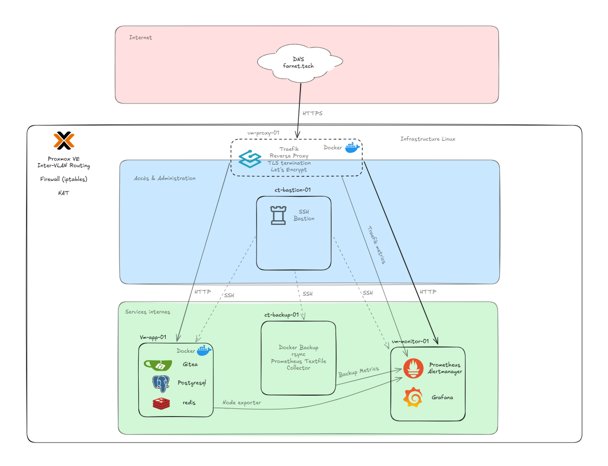

# Administration Linux – Portfolio Infrastructure & Déploiement
## Vue d'ensemble de l'infrastructure

Architecture du laboratoire d'administration Linux mettant en œuvre un bastion SSH, un reverse proxy, des sauvegardes automatisées et une supervision centralisée.

---

Portfolio technique basé sur la conception, l’exploitation et l’administration d’une infrastructure Linux virtualisée sous Proxmox.

Compétences démontrées :

• Administration systèmes Linux
• Exploitation d'infrastructure
• Diagnostic d'incidents
• Automatisation (Ansible)
• Supervision (Prometheus / Grafana)
• Sécurisation des accès
• Sauvegardes automatisées
• Réseau et routage

L’ensemble des projets s’appuie sur une infrastructure cohérente administrée via Ansible.

---

# 🏗️ Infrastructure globale

Infrastructure virtualisée sous Proxmox composée de plusieurs rôles serveur :

|Machine|Rôle principal|
|---|---|
|vm-proxy-01|Reverse proxy Traefik|
|ct-bastion-01|Administration SSH|
|vm-app-01|Hébergement des services|
|ct-backup-01|Sauvegardes automatisées|
|vm-monitor-01|Supervision et alertes|

Services principaux exploités :

- Traefik
- Gitea
- Prometheus
- Grafana
- rsync
- Docker
- SSH
- iptables
- UFW sur le bastion

Environnements utilisés :

- Debian Linux
- Docker
- Proxmox
- Ansible

---

# 📂 Réalisations techniques

## 1️⃣ Sauvegarde Linux – rsync (modèle pull)

Architecture de sauvegarde automatisée et sécurisée.

Fonctionnalités :

- sauvegarde centralisée
- snapshots incrémentiels
- dump PostgreSQL
- accès SSH restreint
- rotation automatique
- restauration validée

Compétences :

- rsync avancé
- stratégie de sauvegarde
- sécurité SSH
- exploitation Linux
- automatisation

Dossier : `backup-rsync`

---

## 2️⃣ Automatisation Infrastructure – Ansible

Déploiement automatisé d’une infrastructure Linux multi-services.

Fonctionnalités :

- orchestration multi-hôtes
- déploiement Traefik
- déploiement Gitea
- supervision Prometheus/Grafana
- durcissement SSH
- gestion centralisée de l'infrastructure
- gestion des secrets via Ansible Vault

Compétences :

- administration Ansible
- automatisation infrastructure
- architecture Linux
- exploitation multi-services

Dossier : `ansible-deploiement`

---

## 3️⃣ Reverse Proxy – Traefik

Mise en place d’un reverse proxy centralisé pour l’exposition sécurisée des services.

Fonctionnalités :

- routage HTTP/HTTPS
- terminaison TLS
- middlewares de sécurité
- exposition contrôlée des services
- intégration Docker

Compétences :

- reverse proxy
- TLS
- sécurité web
- architecture réseau
- exploitation Docker

Dossier : `reverse-proxy-traefik`

---

## 4️⃣ Supervision – Prometheus & Grafana

Mise en place d’une supervision système multi-hôtes.

Fonctionnalités :

- collecte de métriques
- dashboards Grafana
- supervision CPU/mémoire/disque
- monitoring d’infrastructure Linux

Compétences :

- Prometheus
- Grafana
- supervision Linux
- diagnostic de performance

Dossier : `supervision-prometheus`

---

## 5️⃣ Diagnostic d’incident Linux

Méthodologie de diagnostic d’un service web indisponible.

Fonctionnalités :

- analyse du reverse proxy
- analyse réseau
- lecture de logs
- diagnostic du service backend
- résolution d'incident

Compétences :

- troubleshooting Linux
- diagnostic système
- analyse de services
- méthodologie d’incident

Dossier : `incident-diagnostic-linux`

---
## 6️⃣ Réseau – VLAN & Diagnostic

Lab réseau démontrant la segmentation VLAN et le diagnostic de connectivité.

Fonctionnalités :

- configuration IP statique
- segmentation VLAN
- analyse ARP
- diagnostic réseau

Compétences :

- TCP/IP
- VLAN
- diagnostic réseau
- exploitation Linux

Dossier : `reseau-vlan`

---

## 7️⃣ Infrastructure Linux sécurisée

Mise en œuvre d'une infrastructure Linux sécurisée avec contrôle des accès et du trafic réseau.

Fonctionnalités :

- durcissement SSH
- restriction des accès privilégiés
- filtrage réseau avec iptables
- sécurisation du bastion SSH
- contrôle des flux inter-VLAN
- réduction de la surface d'exposition

Compétences :

- sécurité Linux
- SSH
- iptables
- segmentation réseau
- sécurisation d'infrastructure

Dossier : `linux-secure-infrastructure`

---

# 🔐 Approche technique

L’ensemble des projets suit les principes suivants :

- standardisation
- automatisation
- reproductibilité
- sécurisation
- supervision
- séparation des rôles
- validation avant déploiement

Les déploiements critiques sont validés avant application.

Exemples :

- validation configuration SSH
- validation Docker Compose
- validation services web

---

# 🧪 Méthodologie

Chaque projet inclut :

- un objectif technique
- un contexte d’exploitation
- un problème identifié
- une mise en œuvre
- des validations
- une résolution opérationnelle

L’objectif est de démontrer une approche orientée :

- exploitation réelle
- diagnostic
- administration système
- cohérence d’infrastructure

---

# 🛠️ Environnement technique

- Debian Linux
- Proxmox
- Docker
- Ansible
- Traefik
- Prometheus
- Grafana
- rsync
- systemd
- SSH
- iptables
- UFW sur le bastion

---

# 🎯 Positionnement

Portfolio orienté :

- infrastructure Linux
- déploiement et automatisation
- exploitation et diagnostic
- supervision
- sécurité d'infrastructure

Objectif : démontrer la conception, le déploiement et l'exploitation d'environnements Linux multi-services.

---
## 🔗 Dépôt Ansible

→ https://github.com/frederic-am/ansible-lab