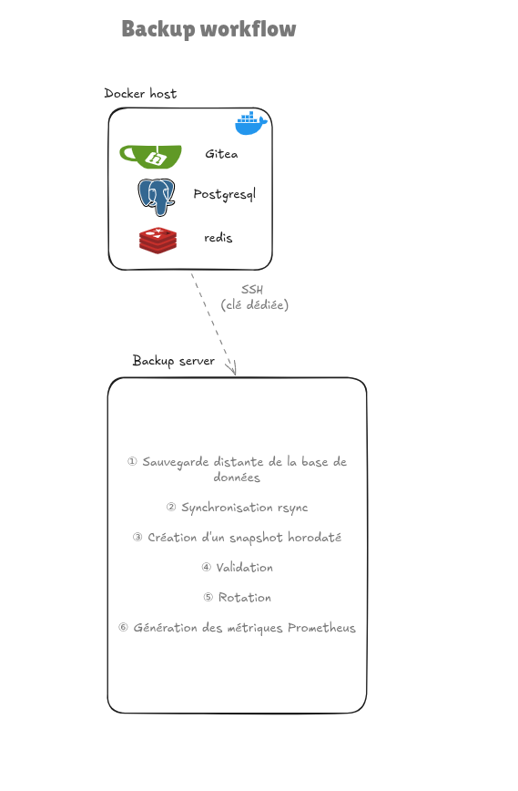

# Docker Backup

Système de sauvegarde applicative des services Docker du lab.

L'objectif est de produire des sauvegardes automatisées, historisées et supervisées, tout en permettant la restauration d'un service individuel.

Le système s'appuie sur :

- `rsync`
- des snapshots horodatés ;
- `rsync --link-dest` ;
- des dumps PostgreSQL lorsque nécessaire ;
- SSH avec clé dédiée et accès restreint ;
- Ansible pour le déploiement ;
- Prometheus pour la supervision.

---

## Architecture

Le processus de sauvegarde repose sur un modèle **pull**.



Le serveur de sauvegarde initie les connexions vers les Docker hosts.

Les Docker hosts n'initient pas de connexion vers le serveur de sauvegarde.

---

## Fonctionnement

Chaque nuit, `backup_runner` exécute :

```bash
/usr/local/sbin/docker-backup.sh <host>
```

Le processus suit les étapes suivantes :

```text
1. Vérification de la configuration DB
2. Dump de la base si nécessaire
3. Synchronisation de /srv/docker
4. Création du snapshot
5. Validation
6. Rotation
7. Génération des métriques Prometheus
```

### Hôte avec base de données

Pour Gitea :

```text
gitea-db
    │
    ▼
db-backup.sh
    │
    ▼
gitea-db.sql
    │
    ▼
rsync /srv/docker/
    │
    ▼
snapshot
```

### Hôte sans base de données

L'absence de base est une situation normale.

Dans ce cas :

```text
Aucune DB configurée
        │
        ▼
Pas de dump SQL
        │
        ▼
rsync /srv/docker/
        │
        ▼
snapshot
```

La totalité de `/srv/docker/` reste donc sauvegardée.

---

## Sauvegarde applicative

La sauvegarde porte directement sur les données applicatives présentes dans :

```text
/srv/docker/
```

Cette approche permet de restaurer un service individuel sans devoir restaurer l'intégralité d'une machine.

Les données qui ne doivent pas être sauvegardées directement peuvent être exclues du `rsync`.

Exemple pour Gitea :

```yaml
backup_excludes:
  - gitea/postgres/
  - gitea/data/tmp/
```

La base PostgreSQL est sauvegardée séparément sous forme de dump logique.

---

## Synchronisation

La synchronisation est réalisée avec :

```bash
rsync -aHAX --delete --numeric-ids
```

Les principales options permettent de conserver :

* les permissions ;
* les propriétaires ;
* les ACL ;
* les attributs étendus ;
* les liens physiques.

Le transfert est réalisé via SSH avec une clé dédiée.

Le serveur de sauvegarde utilise `rsync` en mode pull :

```text
Docker host ───────────────► Backup server
             SSH / rsync
```

---

## Snapshots

Chaque exécution réussie crée un nouveau snapshot horodaté.

Exemple :

```text
/srv/backups/docker/vm-app-01/
├── docker-2026-07-29-111549/
├── docker-2026-07-29-125407/
├── docker-2026-07-29-130931/
└── current -> docker-2026-07-29-130931
```

Les snapshots utilisent :

```bash
--link-dest=<snapshot précédent>
```

Les fichiers inchangés sont alors réutilisés sous forme de hard links.

Le premier snapshot est complet.

Les suivants ne consomment de l'espace supplémentaire que pour les fichiers nouveaux ou modifiés.

---

## Bases de données

Les bases PostgreSQL ne sont pas sauvegardées par copie directe de leur répertoire de données.

Un dump logique est généré avant la synchronisation :

```text
gitea-db
    │
    ▼
pg_dump
    │
    ▼
/srv/docker/backups/gitea-db.sql
```

Le dump est ensuite inclus dans le snapshot par le `rsync`.

Configuration utilisée pour Gitea :

```yaml
backup_db_services:
  - container: gitea-db
    type: postgres
    database: gitea
    user: gitea
```

---

## Sécurisation SSH

L'accès distant utilise un compte dédié :

```text
backup_ro
```

La clé SSH est associée à un wrapper :

```text
/usr/local/sbin/rrsync-wrapper.sh
```

La clé est restreinte afin de n'autoriser que les opérations nécessaires au système de sauvegarde.

Restrictions appliquées :

```text
command="/usr/local/sbin/rrsync-wrapper.sh"
no-agent-forwarding
no-port-forwarding
no-X11-forwarding
no-pty
```

Le wrapper autorise :

* les commandes `rsync` nécessaires à la sauvegarde ;
* l'exécution de `db-backup.sh`.

Les autres commandes sont refusées.

---

## Rotation

Les snapshots sont conservés pendant la durée configurée dans le script de sauvegarde.

Configuration actuelle :

```text
15 jours
```

Les snapshots dépassant cette durée sont supprimés automatiquement.

Le snapshot courant reste accessible via :

```text
current
```

---

## Validation

Après le `rsync`, le script vérifie notamment :

* que le répertoire du snapshot existe ;
* qu'il contient des données ;
* que le `rsync` s'est terminé correctement.

Une sauvegarde réussie produit :

```text
[OK] rsync success
[INFO] Snapshot: docker-...
[INFO] Validation: directory exists and not empty
[OK] Backup completed
```

Une erreur de sauvegarde est enregistrée dans les logs et provoque l'échec du script.

---

## Verrouillage

Le script utilise `flock` afin d'empêcher deux sauvegardes simultanées du même hôte.

```text
/run/lock/docker-backup-<host>.lock
```

Cela évite notamment deux processus concurrents manipulant simultanément le même répertoire de snapshots.

---

## Supervision Prometheus

L'état des sauvegardes est exposé via le **Node Exporter Textfile Collector**.

Le script génère notamment :

```text
backup_status
backup_last_success
backup_last_failure
backup_duration_seconds
```

Exemple :

```text
backup_status{target="vm-app-01"} 1
backup_last_success{target="vm-app-01"} 175379...
backup_duration_seconds{target="vm-app-01"} 4
```

`backup_status` indique le résultat de la dernière tentative :

```text
1 → succès
0 → échec
```

`backup_last_success` permet de contrôler la fraîcheur de la dernière sauvegarde réussie.

La supervision permet donc de détecter à la fois :

* les échecs de sauvegarde ;
* les sauvegardes trop anciennes ;
* les variations de durée.

---

## Organisation des sauvegardes

Les sauvegardes sont organisées par hôte :

```text
/srv/backups/docker/
├── vm-app-01/
│   ├── current
│   ├── docker-2026-07-29-111549/
│   └── docker-2026-07-29-130931/
│
└── vm-proxy-01/
    ├── current
    └── docker-2026-08-10-185459/
```

Chaque snapshot contient les données de `/srv/docker/` correspondant à l'hôte.

Pour Gitea :

```text
docker-2026-07-29-130931/
├── backups/
│   └── gitea-db.sql
├── gitea/
│   ├── config/
│   ├── data/
│   ├── docker-compose.yml
│   └── redis/
└── ...
```

---

## Déploiement

Le système est déployé avec Ansible.

Le rôle `backup-server` configure le serveur central.

Le rôle `backup-client` configure les Docker hosts.

Le périmètre du client est défini par le groupe :

```text
docker
```

Exemple :

```text
docker
├── vm-app-01
└── vm-proxy-01
```

Un hôte Docker sans base de données reste donc entièrement sauvegardé ; seule l'étape de dump SQL est ignorée.

---

## Tests réalisés

Le système a été validé avec :

* déploiement Ansible ;
* vérification de l'idempotence ;
* sauvegarde d'un hôte avec PostgreSQL ;
* sauvegarde d'un hôte sans base de données ;
* exclusions `rsync` ;
* snapshots ;
* `--link-dest` ;
* rotation ;
* restauration de Gitea ;
* restauration PostgreSQL ;
* vérification des permissions ;
* suppression du répertoire temporaire ;
* métriques Prometheus ;
* contrôle d'accès SSH ;
* comportement en cas d'absence de clé du serveur de backup.

---

## Arborescence

```text
backup/
├── README.md
├── Backup & Restore.md
├── docker-backup.sh
├── db-backup.sh
└── images/
    └── backup-architecture.png
```

La procédure détaillée de restauration et les opérations d'administration sont documentées dans :

```text
Backup & Restore.md
```

---
## 🔗 Dépôt Ansible

→ https://github.com/frederic-am/ansible-lab