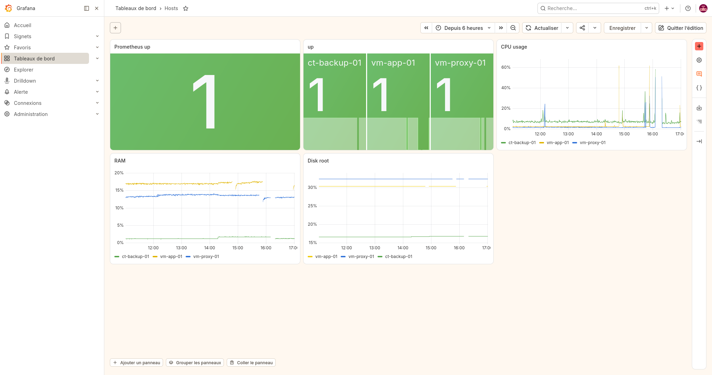
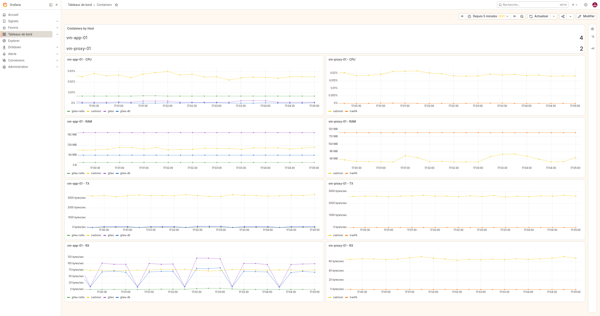
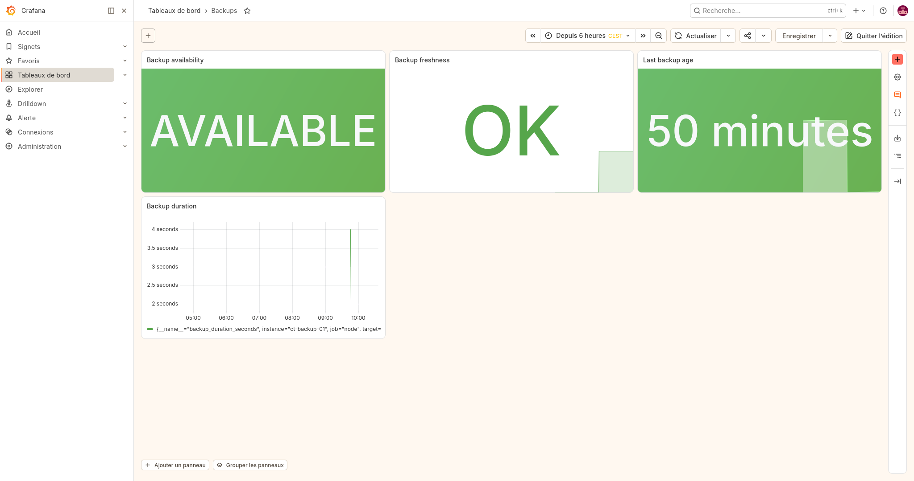
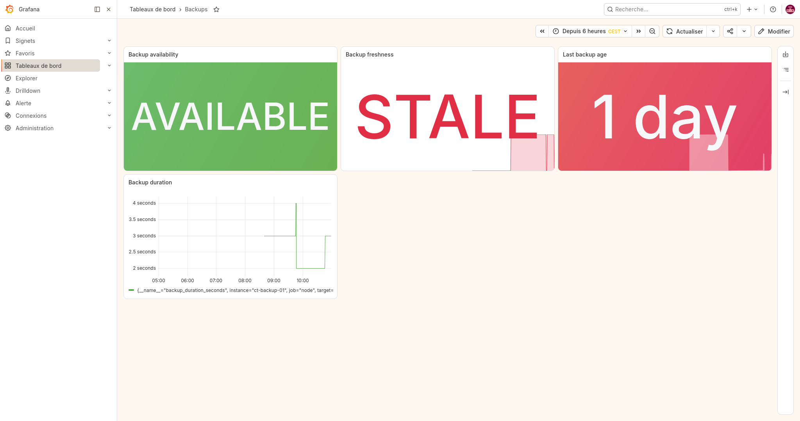
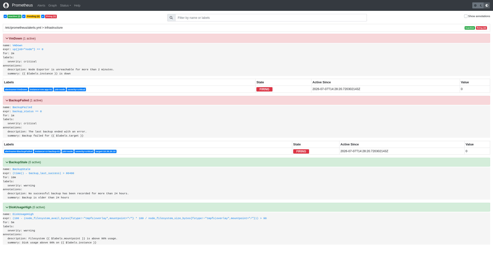
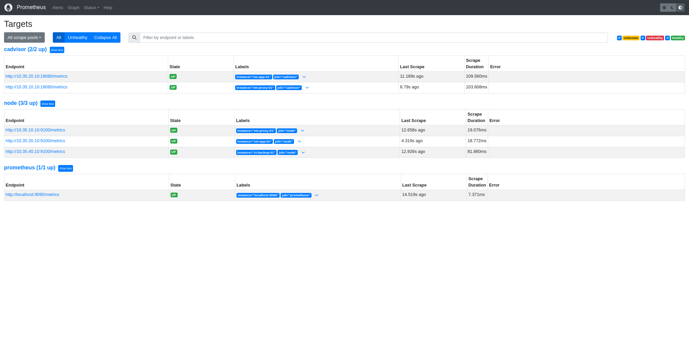

# Supervision d'une infrastructure Linux avec Prometheus & Grafana

## Objectif

Dans le cadre de mon laboratoire d'administration Linux, j'ai conçu et déployé une plateforme de supervision permettant de centraliser l'état de l'infrastructure, des conteneurs Docker, des sauvegardes et du reverse proxy Traefik.

L'objectif était de disposer d'une supervision simple à exploiter, capable de détecter rapidement les incidents les plus courants rencontrés lors de l'administration quotidienne.

---

# Architecture

L'infrastructure supervisée est composée de quatre serveurs.

| Machine | Rôle |
|---------|------|
| vm-monitor-01 | Prometheus / Grafana |
| vm-proxy-01 | Reverse Proxy Traefik |
| vm-app-01 | Applications Docker |
| ct-backup-01 | Sauvegardes |

Les métriques sont collectées par Prometheus puis visualisées dans Grafana.

```
                    Grafana
                        ▲
                        │
                  Prometheus
                        │
   ┌────────────────────┼────────────────────┐
   │                    │                    │
vm-app-01         vm-proxy-01        ct-backup-01
   │                    │                    │
Node Exporter     Node Exporter      Node Exporter
cAdvisor          cAdvisor           Textfile Collector
                  Traefik Metrics    Backup metrics
```

---

# Réalisations

## Déploiement de la plateforme

Déploiement et configuration de :

- Prometheus ;
- Grafana ;
- Node Exporter ;
- cAdvisor ;
- collecte des métriques Traefik ;
- export de métriques personnalisées pour les sauvegardes.

L'ensemble est intégré à l'infrastructure du laboratoire et déployé automatiquement avec Ansible.

---

## Collecte des métriques

La plateforme supervise plusieurs niveaux de l'infrastructure.

### Hôtes Linux

- disponibilité ;
- CPU ;
- mémoire ;
- système de fichiers ;
- réseau.

### Conteneurs Docker

- consommation CPU ;
- consommation mémoire ;
- trafic réseau ;
- nombre de conteneurs.

### Reverse Proxy Traefik

- débit de requêtes ;
- codes HTTP ;
- temps de réponse (95e percentile) ;
- connexions actives ;
- expiration des certificats TLS Let's Encrypt.

### Sauvegardes

Les scripts de sauvegarde génèrent des métriques Prometheus via le Textfile Collector.

Métriques créées :

- backup_status
- backup_last_success
- backup_duration_seconds

---

# Dashboards Grafana

Trois tableaux de bord ont été réalisés.

## Hosts

Vision globale de l'infrastructure :

- disponibilité des serveurs ;
- charge CPU ;
- mémoire ;
- occupation disque.



---

## Containers

Supervision des conteneurs Docker par machine.

Le tableau de bord affiche :

- nombre de conteneurs ;
- consommation CPU ;
- consommation mémoire ;
- trafic réseau ;
- débit des requêtes Traefik ;
- codes HTTP ;
- temps de réponse (P95) ;
- connexions actives ;
- validité des certificats TLS.

Dans cet environnement de laboratoire, le faible volume de trafic limite la représentativité des courbes Traefik, mais valide le bon fonctionnement de la collecte des métriques et des requêtes PromQL.



---

### Backups

Dashboard dédié au suivi des sauvegardes.

Il permet de surveiller :

- la **disponibilité** d'une sauvegarde exploitable (**moins de 7 jours**) ;
- la **fraîcheur** des sauvegardes par rapport à l'objectif quotidien (**moins de 24 heures**) ;
- l'ancienneté de la dernière sauvegarde réussie ;
- la durée d'exécution des sauvegardes.

Les indicateurs **Backup availability** et **Backup freshness** répondent à deux besoins différents :

- **AVAILABLE** indique qu'une sauvegarde exploitable est encore disponible pour une restauration.
- **FRESH** indique que la sauvegarde respecte l'objectif de sauvegarde quotidienne.

Une sauvegarde peut donc être **AVAILABLE** tout en étant **STALE** : elle reste restaurable, mais ne respecte plus l'objectif de fraîcheur défini.





> _Exemple d'alerte : la dernière sauvegarde est encore exploitable mais n'est plus conforme à l'objectif quotidien._



---

# Alertes Prometheus

Quatre règles d'alerte ont été mises en œuvre.

| Alerte | Objectif |
|---------|----------|
| VmDown | Détecter une machine indisponible |
| BackupFailed | Détecter un échec de sauvegarde |
| BackupStale | Détecter une sauvegarde trop ancienne |
| DiskUsageHigh | Détecter un disque rempli à plus de 90 % |

Les alertes sont directement visualisées dans Prometheus.



---

# Validation

Le fonctionnement de la plateforme a été validé par plusieurs scénarios de test :

- arrêt d'une machine supervisée ;
- exécution d'une sauvegarde réussie ;
- simulation d'une sauvegarde ancienne ;
- vérification du déclenchement des alertes ;
- validation des métriques Traefik ;
- vérification de la collecte Prometheus.

Les différents exporters et sources de métriques sont correctement collectés par Prometheus.



---

# Difficultés techniques rencontrées

Le projet a nécessité plusieurs ajustements avant d'obtenir une supervision pleinement opérationnelle.

Les principaux points traités ont été :

- compréhension des métriques Prometheus et de PromQL ;
- intégration de cAdvisor pour superviser les conteneurs Docker ;
- création de métriques personnalisées via le Textfile Collector ;
- résolution d'un problème de permissions empêchant Node Exporter de lire les métriques personnalisées ;
- conception de tableaux de bord adaptés à une utilisation d'exploitation plutôt qu'à une simple démonstration.

Ces difficultés ont permis d'approfondir les mécanismes de collecte des métriques, de supervision et de diagnostic d'une infrastructure Linux.

---

# Compétences démontrées

Au travers de ce projet, j'ai mis en œuvre :

- déploiement automatisé avec Ansible ;
- supervision d'une infrastructure Linux ;
- supervision de conteneurs Docker ;
- supervision d'un reverse proxy Traefik ;
- création de métriques personnalisées ;
- écriture de requêtes PromQL ;
- création de dashboards Grafana ;
- création d'alertes Prometheus ;
- diagnostic et supervision d'exploitation.

---

# Conclusion

Ce projet m'a permis de mettre en place une solution de supervision complète, couvrant les principaux besoins d'une infrastructure Linux : disponibilité des serveurs, supervision des conteneurs, suivi des sauvegardes, surveillance du reverse proxy et alertes.

Il constitue désormais la plateforme de supervision utilisée au sein de mon laboratoire d'administration Linux.

---
## 🔗 Dépôt Ansible

→ https://github.com/frederic-am/ansible-lab